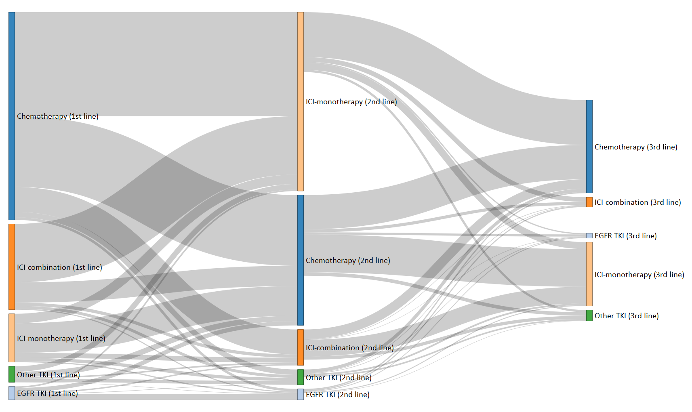

```{css, echo=FALSE}
body .main-container {
max-width: 1280px !important;
width: 1280px !important;
}
body {
max-width: 1280px !important;
}
```

```{r setup, include=FALSE}
library(oncoRegimens)

knitr::opts_chunk$set(echo = TRUE)

```

ARTEMIS provides the user with a tool that can generate sets of alignment scores, using a temporally modified local Needleman-Wunsch / Smith-Waterman algorithm, for comparing regimens and patient drug records derived from electronic health records.

## Connecting ARTEMIS to the OMOP CDM

ARTEMIS interacts directly with the Observational Medical Outcomes Partnership (OMOP) Common Data Model (CDM), a convenient and widely used format for storing observational health data derived from electronic health records. For users of ARTEMIS with access to data already stored in an OMOP CDM compliant datasource, drug records can be easily and automatically mapped to the drug record strings required by ARTEMIS.

A toy dataset, created using [duckdb](https://duckdb.org/) is included in the ARTEMIS package, and will be used throughout this short vignette.


```{r Setup Con} 
con <- DBI::dbConnect(duckdb::duckdb(), "data/Artemis_Vignette_5.3_0.8.duckdb")

cdm <- CDMConnector::cdm_from_con(con = con,
                                  cdm_schema = "main",
                                  write_schema = "main")
```

## Selecting patients (A cohort)

Before running ARTEMIS, a cohort json object is required. Cohorts are a fundamental building block for observational data analysis and each cohort is simply constructed by selecting a set of persons or patients who satisfy a set of inclusion criteria, such as a specific condition or a specific drug exposure. Users of ARTERMIS are expected to utilise a cohort of cancer patients, but any cohort format is accepted. More information on cohorts can be found within [The Book of OHDSI](https://ohdsi.github.io/TheBookOfOhdsi/Cohorts.html).

Again, a toy cohort example is included for the purposes of this vignette, selecting all patients within our database. We use the package CDMConnector to both read our cohort description file (In json format) into R and to construct a cdm object armed with this cohort set.

```{r Setup Cohorts}
validPatients <- CDMConnector::readCohortSet("data/exampleCohort")
cohortName <- "examplecohort"
```

## Loading Regimen and Drug data

To successfully run ARTEMIS, a user must provide both a list of valid drugs and a set of regimens which they would like to search for among patient records. The valid drug list must include all drugs found within any regimens within the set, and should also include any relevant drugs that are not found in regimens but are still clinically relevant. 

In this vignette example, we will explore three pain suppression regimens - two paracetamol and ibuprofen monotherapies and a combination therapy of both drugs. As such, we include paracetamol and ibuprofen within our valid drugs. We also include aspirin, as patients who take aspirin in combination with either of these two drugs, or alone, are likely to be on a different pain suppression regimen which we must account for. We choose not to include unrelated drugs, such as warfarin, as these are likely only to interfere with regimen discovery and are not included in a typical pain suppression regimen.

The choice of which drugs are considered valid can have large effects on the final score of all regimens.

In the case of cancer patients, a large set of valid drugs has been collected from the HemOnc reference resource, which can be loaded with the loadDrugs() function and a set of regimens derived from the same source may be loaded via loadRegimens() In this vignette, we will use 2 custom .csv files to load our data.


The minimum valid format for a valid drugs dataframe:

| name      | valid_concept_id |
| ----------- | ----------- |
| acetaminophen      | 1125315       |
| ibuprofen   | 1177480        |
| aspirin   | 1112807        |


The minimum valid format for a regimen dataframe:

| regName      | shortString |
| ----------- | ----------- |
| Acetaminophen Monotherapy | 1.acetaminophen;7.acetaminophen;                         |
| Ibuprofen Monotherapy     | 1.ibuprofen;7.ibuprofen;                                 |
| Acetaminophen & Ibuprofen | 1.acetaminophen;0.ibuprofen;7.acetaminophen;0.ibuprofen; |


By creating such files and importing them as .csv's, custom regimens and sets of drugs may be easily supplied by the user with which to utilise the ARTEMIS implementation of the TSW algorithm.

```{r Load Data}
#loadDrugs()
#loadRegimens(condition="lungCancer")
validDrugs <- read.csv("data/example_drugMap_Valid.csv")
regimens <- read.csv("data/example_regimens.csv")
```

## Creating a string dataframe

The temporal smith-waterman (TSW) algorithm requires that input drug records take the form of individual strings, with both drug and temporal information stored within the string. The function stringDF_from_cdm() allows us to generate such strings from a given EHR. The format of each patient's total drug record thus takes the form:

[Days since last exposure].[Drug exposure];[Days since last exposure][Drug exposure];...;

Drug exposures which occur on the same day are listed as having 0 days since last exposure. The specific order of exposures that occur on the same day will not effect the TSW score, as these will be dynamically reordered during alignment.

This dataframe may then be filtered to include only patients with a number of drug exposures above a certain cut-off value. First, we must pull our CohortSet into R via CDMConnector.

It is important to note that, depending on the size of the CDM a user is connecting to and the size of their target cohort, the function getCohortSet() may take several minutes.

```{r Create and Filter StringDF}
con_df <- getCohortSet(cdm = cdm, json = validPatients, name = cohortName)

stringDF <- stringDF_from_cdm(con_df = con_df, writeOut = F, validDrugs = validDrugs)

stringDF <- stringDF %>% filter_stringDF(min = 0)

stringDF
```

## Running the algorithm

Once a set of patients have been summarized into a strinDF data frame, and all relevant regimen data are loaded, alignment via the TSW algorithm can commence.

The TSW algorithm requires several additional input parameters, which are described as follows:

g - The gap penalty for a missing component, reccomended range 0.4-0.6
Tfac - The maximum time penalty it is possible to impose on a regimen due to a difference in period, reccomended range 0.4-1
method - The method used for calculating the score penalty given Tfac and the difference in time between the regimen and observed drug record. "PropDiff", proportional difference, is highly reccomended.


```{r Running the alignment}
options(width=800)

output_all <- stringDF %>% generateRawAlignments(regimens = regimens,
                                                 g = 0.4,
                                                 Tfac = 0.5,
                                                 verbose = 0,
                                                 method = "PropDiff")

output_all[c(4,5,6,98,99,100,481,482,483),c(1,3,4,7,8,11,12)]

```

Our output file contains the local score of any passing regimens at any point throughout each patient's drug record. All results are calculated exhaustively, but only those with a total score (Raw score / Number of aligned pairs) greater than 0.6 are returned.

An output file may contain a large number of low-scoring and overlapping regimens, especially when many similar sets of regimens are used as input. A post-processing step may be performed to reduce this unnecessary complexity by condensing and combining regimens into discrete, non-overlapping regimen eras.

These processed alignments may then be visualized and compared to their source drug record in order to validate the results of an alignment visually. This forms the basis of the most "sanity checking" when looking at regimen alignment outputs.

Discrete regimen alignments that occur within a specific number of days from the end of any previous regimen with the same name are automatically combined. This period is defined by the regimenCombine value, which defaults to 28 days - one typical cycle. Other potential values may be 56 days, 7 days or 0 days, which would cause the processed output to reflect only the raw alignment values.

Regimen eras connected by a small line indicate that these regimen eras are potentially part of the same treatment, but that the period between them was larger than the value set by regimenCombine.

```{r Post-processing/Plotting, fig.width=10, fig.align="center", warning=FALSE}
output_processed <- processAlignments(rawOutput = output_all, regimens = regimens, regimenCombine = 28)

plotOutput(output_all[output_all$personID=="3",])

plotOutput(output_all[output_all$personID=="149",])

plotOutput(output_all[output_all$personID=="160",])

```

## Output files and downstream stats

Information regarding the overall output can be directly produced from this processed dataframe. Statistics such as the underlying frequency of each individual regimen in the all patient data may be created and visualized, alongside the score and length distributions for a given regimen, or two given regimens.

```{r, fig.width=7, fig.align="center", warning=FALSE}

plotFrequency(output_processed)

```
The underlying score and length distributions of regimens can provide a general understanding of how long patients are likely to have spent on a partciular regimen era before discontinuation or swapping to a second or third era regimen. The score distribution provides a general understanding of how well each patient adhered to the regimen, specifically in terms of their alignment score, and may be used to identify poorly scoring regimens, i.e., those regimens which were more likely to be gapped or contain extra non-prescribed elements.

The mean +/- sd is also calculated and plotted alongside this histogram, as well as a density plot. Both the median and IQR are also calculated and are set as a caption for each plot.

```{r, fig.width=7, fig.height=7,fig.align="center", warning=FALSE}

plotScoreDistribution(regimen1 = "Acetaminophen Monotherapy", regimen2 = "Ibuprofen Monotherapy", processedAll = output_processed)

plotRegimenLengthDistribution(regimen1 = "Acetaminophen Monotherapy", regimen2 = "Ibuprofen Monotherapy", processedAll = output_processed)

```
Further, by adding information about the sequencing of individual regimen eras, we can derive more detailed information regarding a patient's treatment trajectory.

First era regimens are those which are observed first after entry into the cohort, though this does not preclude a patient's exposure to other anti-neoplastic agents which do not form part of any known regimen. Second era regimens are those regimens patients are prescribed after completing or suspending a first era regimen. All other regimens fall under the "tertiary" or "other" category.

Regimens of the same name cannot count as both a first and second era regimen in a single patient unless a significant treatment discontinuation is observed between these eras. This discontinuation value may be set by the user, but has the default of 120 days. 90 days is also a commonly used treatment discontinuation period. In the following example, any regimens of the same name that occur within 90 days of another regimen's end date will not be counted towards these statistics, nor returned in the eras data object.

```{r, fig.width=10, fig.align="center", warning=FALSE}

output_eras <- output_processed %>% calculateEras(discontinuationTime = 90)

regStats <- output_eras %>% generateRegimenStats()

regStats[,-c(4,7)]

```
We can also produce some graphics which indicate the relative first/second era frequency of a given regimen. It may also be useful to produce a sankey which displays the progression of all patients between different groups of regimens (Displaying all regimens at once in almost all real use cases would be overwhelming). To do this, a regimen grouping dataframe must be loaded and takes the following format:

| regName      | regGroup |
| ----------- | ----------- |
| Acetaminophen Monotherapy | Acetaminophen-based |
| Ibuprofen Monotherapy     | Ibuprofern-based |
| Acetaminophen & Ibuprofen | Combination-therapy |

A user may input a custom .csv or use a set of default groupings created by loadGroups().

For the purpose of this vignette, presently a sankey from a more complicated example is loaded and displayed, due to the limited nature of the vignette data set not being suitable for such a graphic. A more complicated vignette dataset will be available shortly.

```{r, fig.width=10, fig.align="center", warning=FALSE}

plotErasFrequency(output_eras)

#loadGroups()
#plotSankey(output_eras, regimen_Groups)


```


